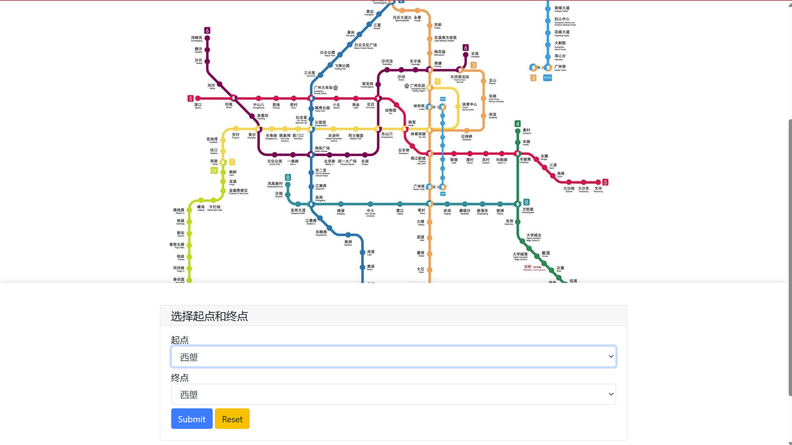
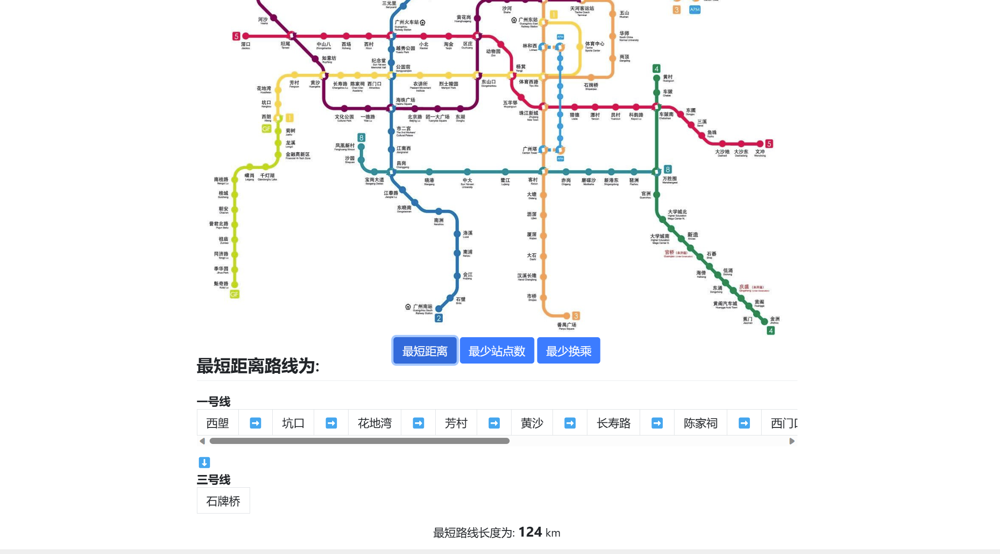
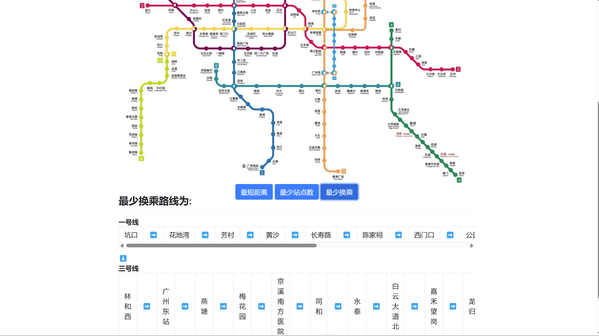
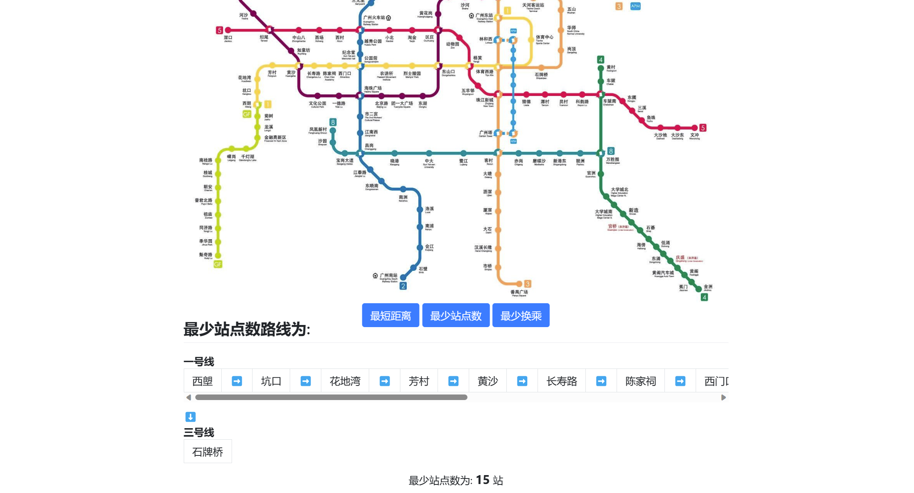

# Data-Structure-and-Algorithm-Assessment


## 🤖 Introduction
🤹The goal of the project is to find best plan among the subway lines in Seoul, which is based on the data structure and algorithm.


## 🤸 Quickstart
- Clone the repository
```bash
git clone git@github.com:david188888/SubwayRoute-management.git
```

- Install the dependencies
```bash
pip3 install -r requirements.txt
```

- Run the code
```bash
python3 main.py
```


## 🤼‍♂️ How to use
1. Choose the start station and end station


2. Choose the best plan
   - Choose the __shortest__ line 
  
   - Choose the __least transfer__ line
  
   - Choose the __least station__ line
  


## 🤽‍♀️ Data Structure
- Graph
  - node 
    - value
    - adjacent
  - edge
  - weight
- Stack
  - list
